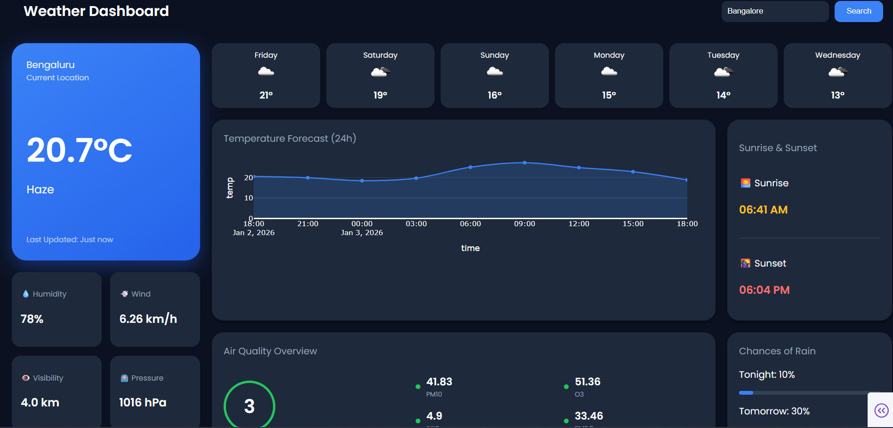

# 🌦️ Professional Weather Dashboard

A production-grade real-time weather application built with **Python Dash** and **OpenWeatherMap API**. 
This project demonstrates modern UI principles (Glassmorphism & Bento Grid) combined with robust backend data processing.


*(Note: You can upload a screenshot later to make this look even better!)*

## 🚀 Key Features
* **Real-Time Data Pipeline:** Fetches live weather, humidity, wind, and visibility data via REST API.
* **Bento Grid Layout:** A responsive, CSS Grid-based layout inspired by modern dashboard designs.
* **Interactive Visualizations:** * 24-Hour Temperature Forecast (Plotly spline chart).
    * Air Quality Index (AQI) analysis with pollutant breakdown (PM2.5, NO2, SO2).
    * Sunrise & Sunset tracking.
* **Error Handling:** "Crash-proof" search logic that handles missing API data gracefully.

## 🛠️ Tech Stack
* **Frontend:** Dash (React.js wrapper), Plotly, CSS3 (Grid/Flexbox).
* **Backend:** Python 3.x, Pandas, Requests.
* **API:** OpenWeatherMap (5-Day Forecast & Air Pollution endpoints).

## ⚙️ How to Run Locally
1.  **Clone the repository**
    ```bash
    git clone [https://github.com/YOUR_USERNAME/weather-dashboard.git](https://github.com/YOUR_USERNAME/weather-dashboard.git)
    ```
2.  **Install dependencies**
    ```bash
    pip install -r requirements.txt
    ```
3.  **Configure API Key**
    * Create a `.env` file in the root folder.
    * Add your key: `OPENWEATHER_API_KEY=your_api_key_here`
4.  **Launch the App**
    ```bash
    python app.py
    ```
    Visit `http://127.0.0.1:8050` in your browser.

## 🔮 Future Improvements
* [ ] Add "Dark/Light" mode toggle.
* [ ] Deploy to cloud hosting (Render/Heroku).
* [ ] Add historical weather data comparison.

---
*Created by [Your Name]*